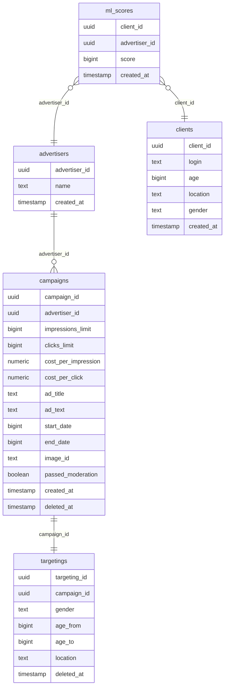
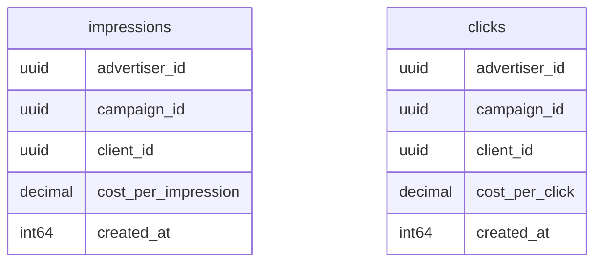
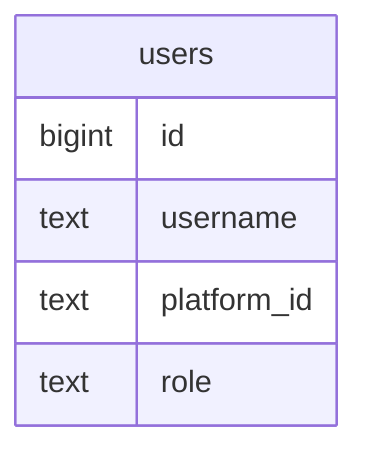

# 📢 **PROD Backend 2025 Рекламная платформа**

🚀 *Краткое описание проекта. Несколько предложений о назначении и функционале.*

---

## 📝 **Содержание:**
- [1. Инструкция по запуску](#1--инструкция-по-запуску)
- [2. Демонстрация работы](#2--демонстрация-работы)
- [3. Схема данных СУБД](#3--схема-данных-субд)
- [4. Описание работы алгоритма подбора рекламы](#4--описание-работы-алгоритма-подбора-рекламы)
- [5. Запуск e2e тестов](#5-запуск-e2e-тестов)

---

## 1. 💻 **Инструкция по запуску**

### ✅ **Предварительные требования:**
- Docker и Docker Compose установлены на системе.
- Убедитесь, что необходимые порты свободны.

****Опциональные параметры****

В .env файле есть переменная, отвечающая за включение/выключение модерации, называется AD_MODERATION_ENABLED.
Для того чтобы протестировать эту фичу, нужно установить true в эту переменную 

1. Проект запускается с помощью Docker Compose:
    ```bash
    docker-compose up -d --build
    ```

### **Устройство docker-compose.yaml файла**
Всего есть 8 контейнеров. 6 из них отвечают за инфраструктура, два являются частями итогового продукта

Сперва расскажу о контейнерах, отвечающих за инфраструктуру + сразу же обосную свой выбор:

1. Контейнер **db**: Является основной базой данных нашего API рекламной платформы. В качестве бд взял Postgre, т.к. она идеально подходит для любых нагрузок + опыт работы с ней большой.
В ней хранятся клиенты, рекламодатели, ml-scor'ы, кампании и таргетинг для каждой кампании.

2. Контейнер **redis**: Используется как State-машина в телеграм боте + также используется для ускорения получения рекламы клиентом(хранит в себе количества показов, кликов и т.д., чтобы не ходить за ними в clickhouse).
Взял именно Redis т.к. он закрывает все потребности(State-машина и т.д.) + также есть опыт работы с ним.

3. Контейнер **clickhouse**: Используется для хранения показов и кликов, отвечает за аналитику. Взял его т.к. clickhouse является популярным и неплохим решением вопросов, связанных с аналитикой.

4. Контейнер **minio**: Используется как S3 хранилище для фотографий кампаний. Выбрал его, т.к. есть удобный клиент для Go + полностью решает задачу хранения изображения.

5. Контейнер **grafana**: Используется для визуализации данных из clickhous'а. Взял именно grafan'у т.к. она является одним из популярных решений проблем визуализации.

6. Контейнер **bot_db**: Является базой данных для бота. БД Postgres по тем же причинам. Хранит в себе информацию о пользователях.

Далее следуют два основных контейнера:

1. Контейнер **api**: API рекламной платформы.

2. Контейнер **bot**: Телеграм бот, реализующий интерфейс для API рекламной платформы. Username бота: @ad_buddy1_bot

**Другие зависимости**

В качестве ИИ для генерации текстов использовал GigaChat. Выбрал его, т.к. является довольно неплохим и главное бесплатным решением.
Основной язык, на котором написан проект - Go. Выбрал его, потому что это мой основной язык =)

---

## 2. 📸 **Демонстрация работы**

### 🗂️ **Основные сценарии:**
- ✅ **Управление пользователями и рекламодателями:**
1. Массовое создание пользователей(POST base_url/clients/bulk).
2. Массовое создание рекламодателей(POST base_url/advertisers/bulk).
3. Получение пользователя по ID(GET base_url/clients/{clientId}).
4. Получение рекламодателя по ID(GET base_url/clients/{clientId}).
5. Добавление ML-скора между пользователем и рекламодателем(POST base_url/ml-scores).

- ✅ **Создание и обновление рекламных кампаний:**
1. Создание рекламной кампании (POST baseurl/advertisers/{advertiserId}/campaigns).
2. Получение рекламной кампании по ID (GET baseurl/advertisers/{advertiserId}/campaigns/{campaignId}).
3. Обновление рекламной кампании (PUT baseurl/advertisers/{advertiserId}/campaigns/{campaignId}).
4. Удаление рекламной кампании (DELETE baseurl/advertisers/{advertiserId}/campaigns/{campaignId}).
5. Список рекламных кампаний рекламодателя с пагинацией (GET baseurl/advertisers/{advertiserId}/campaigns).

- ✅ **Показ рекламы пользователям:**
1. Получение рекламного объявления для клиента (GET baseurl/ads?client_id={clientId}).
2. Фиксация перехода по рекламному объявлению (POST baseurl/ads/{adId}/click).

- ✅ **Получение статистики и отчётности:**
1. Получение статистики по рекламной кампании (GET baseurl/stats/campaigns/{campaignId}).
2. Получение агрегированной статистики по всем кампаниям рекламодателя (GET baseurl/stats/advertisers/{advertiserId}/campaigns).
3. Получение ежедневной статистики по рекламной кампании (GET baseurl/stats/campaigns/{campaignId}/daily).
4. Получение ежедневной агрегированной статистики по всем кампаниям рекламодателя (GET baseurl/stats/advertisers/{advertiserId}/campaigns/daily).

- ✅ **Управление временем:**
1. Установка текущей даты для системы (POST baseurl/time/advance).

- ✅ **Генерация текста для рекламного объявления по его названию и названию рекламодателя**
POST base_url/advertisers/{advertiserId}/generate-ad-text

В теле запроса можем указать два параметра, один из которых не обязательный(context):
```json
{
    "ad_title": "Самые вкусные пирожки",
    "context": "Добавь в текст много смайликов"
}
```

В ad_title указываем название рекламной кампании, а в context при желании добавляем контекст к генерации.

В результате я получил
```json
{
    "generated_text": "Приготовься к взрывному вкусу! Наши бабушкины пирожки просто умопомрачительны! 😋🥧✨"
}
```

*Доп. фича*
Нейросеть распознаёт язык названия рекламного объявления и выдаёт сгенерированный текст на распознанном языке.


- ✅ **Модерация контента кампании**
GET base_url/moderation/campaigns

Выдаёт список кампаний, ещё не прошедших модерацию.
Кампания попадает на модерацию после создания и редактирования её полей. Кампании находящиеся на модерации не показываются клиентам при просмотре рекламных объявлений.

POST base_url/moderation/moderate/{campaignId}

Отмечает, прошла ли кампания модерацию или нет. Т.к. плохие и грубые слова в рекламных объявлениях нам не нужны, мы очень строго относимся к модерации и, если кампания её не проходит, то она удаляется.

Тело запроса
```json
{
    "passed_moderation": true
}
```

- ✅ **Установка/удаление изображения у рекламного объявления**
POST base_url/advertisers/{advertiserId}/campaigns/{campaignId}/image

Устанавливает картинку на рекламное объявление(после установки её видно клиентам, просматривающим рекламу).

Выставляем всё как на скриношоте, отправляем запрос, в ответ получаем ссылку, по которой можем посмотреть нашу картинку.


Удаление работает по тому же пути, но уже с методом DELETE.
DELETE base_url/advertisers/{advertiserId}/campaigns/{campaignId}/image

- ✅ **Просмотр статистики рекламной платформы в grafana**

После запуска всех контейнеров переходим на http://localhost:3000. Проходим авторизацию используя стандартный логин и пароль(admin, admin).
Переходим в Dashboards, открываем Ad Platform Metrics и наслаждаемся графиками =) Они особенно прекрасны, когда кликов и показов много, и сделаны они в разные дни.

- ✅ **Логика работы бота**

Находим в телеграмме бота по usernam'у @ad_buddy1_bot, нажимаем /start.
Встречает нас авторизация, можем залогиниться как клиент(сперва нужно создать на платформе) или как рекламодатель(сперва нужно создать на платформе). Для авторизации запрашивается client или advertiser id.
В главном меню клиента нас ждёт функционал просмотра рекламных объявлений и клика на те, которые понравились. В главном меню рекламодателя наш ждёт список кампаний рекламодателя,
кнопка создания новой кампании, статистика по рекламодателю и генерация текста для кампании по её названию и названию рекламодателя. Через список кампаний рекламодателя можно перейти к конкретной кампании
и соответственно взаимодействовать с ней(обновить, удалить, посмотреть статистику). Очень старался, надеюсь вам понравится =)

---

## 3. 🗂️ **Схема данных СУБД**

📋 **Описание таблиц:**

**Таблицы основной бд API**

- **Clients** - хранит информацию о клиентах.
- **Advertisers** — хранит информацию о рекламодателях.
- **Campaigns** — данные рекламных кампаний и таргетинга.
- **MLScores** — хранит ML-скор пользователей по рекламодателям.




**Таблицы Clickhous'а для статистики**

- **Impressions** — уникальные показы рекламы.
- **Clicks** — логирование кликов по рекламе.




**Таблица основной бд Телегам бота**

- **Users** — хранит данные пользователей.




---

## 4. 🌐 **Описание работы алгоритма подбора рекламы**

Алгоритм подбора рекламного объявления для пользователя работает следующим образом:

1. **Получение данных клиента и текущего дня:**
    - Запрашивается информация о клиенте по его ID.
    - Получается текущий день в системе.

2. **Фильтрация кампаний по таргетингу:**
    - Из базы данных выбираются рекламные кампании, подходящие клиенту по таргетингу и текущему дню.

3. **Расчёт статистики для кампаний:**
    - Вычисляется средний и стандартное отклонение ML-скора для текущего пользователя и выбранных рекламодателей.
    - Рассчитывается средний и стандартное отклонение для стоимости показа (CPI) и клика (CPC).
    - Для каждой рекламной кампании определяются её средний и стандартное отклонение ML-скора.

4. **Оценка каждой кампании:**
    - Для каждой кампании считаются:
        - Количество показов и кликов.
        - Проверяется, кликал ли пользователь по этой кампании ранее.
        - Определяется минимальный ML-скор для показа рекламы (исходя из текущих лимитов и времени до окончания кампании).
        - Если ML-скор пользователя меньше минимального, кампания пропускается.

5. **Расчёт итогового скора кампании:**
   Итоговый скор вычисляется по формуле:
   \[ Score = Profit + (NormMLScore * 0.5) + (LimitDone * 0.07) \]
    - Profit = Normalized CPI + Normalized CPC * Probability of Click
    - NormMLScore – нормализованный ML-скор пользователя.
    - LimitDone – отношение оставшихся лимитов к общему количеству.

6. **Выбор оптимальной кампании:**
    - Кампании сортируются по убыванию итогового скора.
    - Выбирается первая кампания, которую пользователь ещё не видел или для которой ещё не исчерпан лимит показов.

7. **Фиксация показа рекламы:**
    - Записывается информация о показе в таблицу показов (impressions).
    - Пользователь отмечается как увидевший эту кампанию.

8. **Возврат данных для отображения:**

---

## 5. **Запуск e2e тестов**

1. При развёрнутом docker-compose.yaml пропишите docker-compose down
2. Перейдите в папку api и используйте команды Makefile для запуска e2e тестов, а именно: e2e-test. Он развернёт всё, что необходимо для тестов, прогонит их и затем свернёт обратно.


## 📬 **Контакты:**
*Если у вас есть вопросы, свяжитесь со мной:*
- ✉️ Email: ugulaev806@yandex.ru
- 💼 GitHub: [Ваш профиль](https://github.com/Uikola)

---

